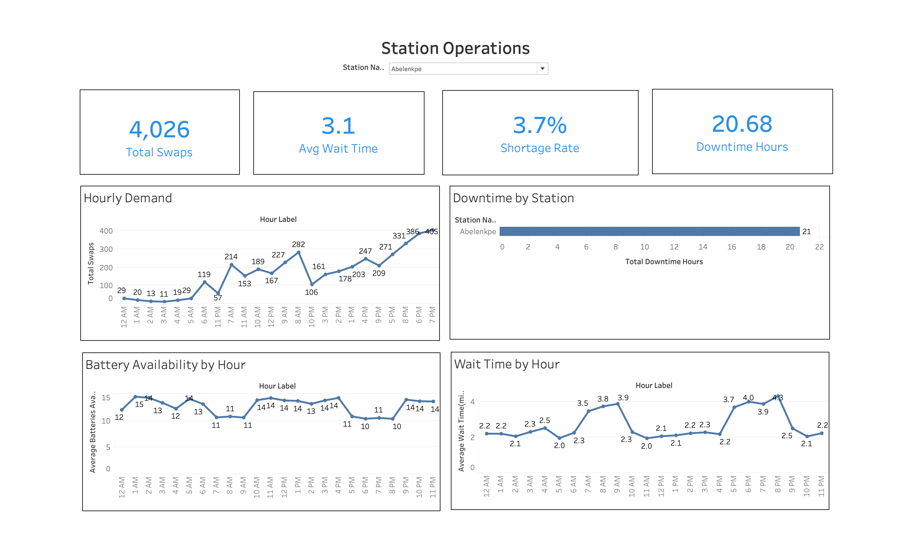
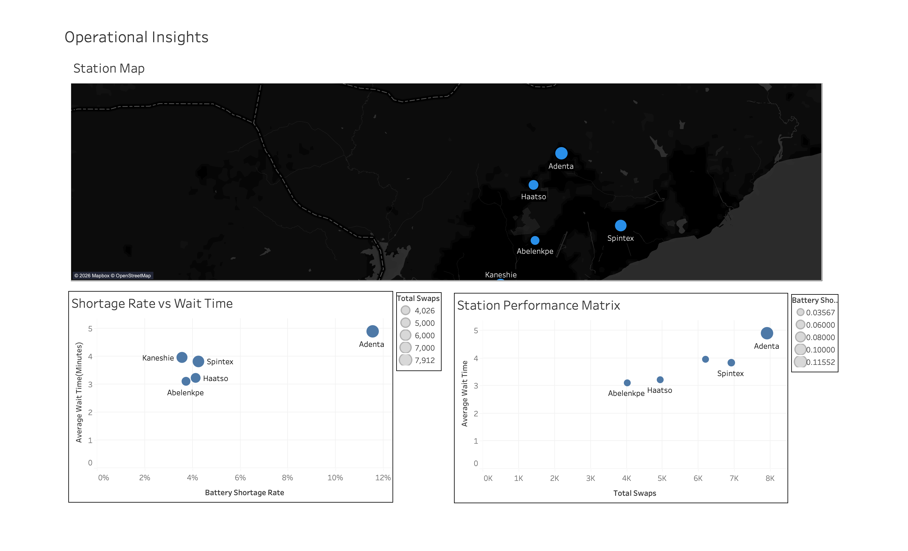

# EV Swap Network Operations Intelligence

A simple Business Intelligence project built with **Tableau Public and Python** to analyze the performance of an EV battery-swap network.

## Project Goal

The goal of this project is to understand:

* Which stations have the highest number of swaps
* When demand is highest during the day
* Which stations experience more downtime
* How long customers wait
* How often battery shortages happen
* How much revenue the network generates

## Tools Used

* **Tableau Public** — for building the dashboards and visualizing KPIs
* **Python** — for basic exploratory analysis
* **Pandas** — for data analysis
* **Matplotlib / Seaborn** — for exploratory charts
* **Git / GitHub** — for version control and project sharing

## Dataset

The project uses two main datasets:

### `stations.csv`

Contains station information such as:

* Station ID
* Station name
* District
* Latitude
* Longitude
* Capacity

### `swap_transactions.csv`

Contains swap transaction information such as:

* Swap ID
* Timestamp
* Station ID
* Customer wait time
* Swap duration
* Battery availability
* Downtime
* Payment amount
* Payment method

## Main KPIs

The Tableau dashboards track:

* Total Swaps
* Total Revenue
* Average Wait Time
* Battery Shortage Rate
* Total Downtime Hours

## Tableau Dashboards

Three dashboards were created in **Tableau Public**.

### 1. Network Overview

Shows the overall performance of the battery-swap network.

Includes:

* Total swaps
* Revenue
* Average wait time
* Battery shortage rate
* Downtime
* Weekly swap trend
* Swaps by station
* Hourly demand


### 2. Station Operations

Focuses on station-level performance.

Includes:

* Station filter
* Hourly demand
* Battery availability by hour
* Wait time by hour
* Downtime by station



### 3. Operational Insights

Used to compare stations and identify operational problems.

Includes:

* Station performance comparison
* Shortage rate analysis
* Wait time analysis
* Station map



## Key Findings

* The network recorded **30,000 battery swaps**.
* Total revenue was approximately **GHS 1.07 million**.
* Average customer wait time was approximately **3.9 minutes**.
* The overall battery shortage rate was approximately **5.9%**.
* Total network downtime was approximately **116 hours**.
* Adenta recorded the highest number of swaps.
* Adenta also recorded the highest downtime.
* Demand was highest during the evening period.

## Recommendations

* Redistribute charged batteries before peak demand periods.
* Pay closer attention to high-demand stations such as Adenta.
* Investigate the causes of downtime at busy stations.
* Monitor battery shortage rates together with customer waiting times.
* Use station-level demand patterns to improve battery allocation.

## Project Structure

```text
ev_swap_network_bi/
│
├── data/
│   ├── stations.csv
│   └── swap_transactions.csv
│
├── notebooks/
│   └── exploratory_analysis.ipynb
│
├── documentation/
│   └── project_findings.md
│
├── screenshots/
│   ├── network_overview.png
│   ├── station_operations.png
│   └── operational_insights.png
│
├── EV_Swap_Network_Operations.twbx
├── README.md
└── .gitignore
```

## Tableau Public

Interactive dashboards were created and published using **Tableau Public**.

**Tableau Public Link:**
https://public.tableau.com/shared/G3PGW7XJF?:display_count=n&:origin=viz_share_link
